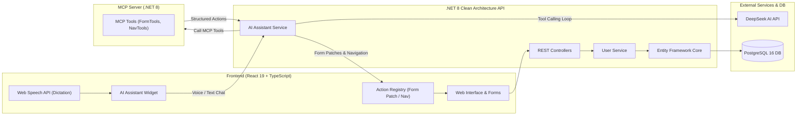

# 🎓 School & User Management System with AI Assistant (MCP)

[](#) [](README_TR.md)
[](https://dotnet.microsoft.com/)
[](https://react.dev/)
[](https://www.typescriptlang.org/)
[](https://www.postgresql.org/)
[](https://www.docker.com/)
[](https://modelcontextprotocol.io/)

> 🇹🇷 **Türkçe dokümantasyon için [README_TR.md](README_TR.md) dosyasına göz atabilirsiniz.**

---

## 🌟 Overview

The **School & User Management System** is an enterprise-grade web application built around **Clean Architecture**, modern **React 19**, and the **Model Context Protocol (MCP)** standard.

The application enables seamless registration and management of **Students** and **Teachers**, validates critical Turkish identity credentials (TC Identity Number, unique email, date checks), and features an **autonomous AI Assistant** capable of voice dictation (Speech-to-Text), real-time form autofill via MCP tool-calling, and dynamic client-side page navigation.



---

## 🚀 Key Highlights

1. **Student Registration Page (`/form`, `/student`, `/ogrenci`)**:
   - First name, last name, 11-digit TC identity number, email, mother's name, father's name, birth date.
   - Instant client validation and server-side domain constraint checks.
   - Comprehensive registration receipt card upon submission.

2. **Teacher Registration Page (`/teacher`, `/ogretmen`)**:
   - Dedicated branch/specialty selection (*Mathematics, Physics, Chemistry, Biology, Turkish, IT/Software, English, etc.*) alongside standard identity fields.
   - Real-time suggestions datalist plus custom input support.
   - Independent state management and instant AI tool-calling support.

3. **Users Directory & Search (`/users`)**:
   - Live search filter across name, surname, TC number, email, and parents.
   - Real-time record statistics counter and manual refresh capabilities.

4. **Floating AI Assistant & Voice Dictation**:
   - **Speech-to-Text (STT)** powered by the browser Web Speech API (`tr-TR`), supporting continuous hands-free voice dictation.
   - Multi-turn conversation history with DeepSeek AI.
   - **MCP Tool-Calling Execution Loop**: As the user speaks or types (*e.g., "Set the student name to Ahmet and birth date to 2005-04-12"*), the backend invokes MCP tools and dispatches `form_patch` actions that directly populate React form inputs on the client.
   - **Navigation Action**: The AI can programmatically redirect users (*e.g., "Take me to the teacher page"* triggers client-side navigation to `/teacher`).

5. **Model Context Protocol (MCP) Server**:
   - Modular MCP microservice running on port `5001` with Streamable HTTP transport (`/mcp`).
   - Standardized tools for page identification, dynamic form schemas, form status checks, student form patching, and teacher form patching.

---

## 🏛️ Architecture & Technology Stack

### A. Frontend
- **Framework:** React 19, TypeScript, Vite
- **Routing:** `react-router-dom` v7 with aliases (`/form`, `/ogrenci`, `/teacher`, `/ogretmen`, `/users`)
- **State Management:** React Context API (`FormContext`, `FormProvider`) handling partitioned student and teacher form states
- **Voice Recognition:** Web Speech API (`webkitSpeechRecognition` / `SpeechRecognition`) with auto-reconnection and continuous streaming
- **Styling:** Modern responsive CSS with custom design tokens, dark/light theme variables, glassmorphism, and responsive grid layouts

### B. Backend (.NET 8 Clean Architecture)
Organized into 4 decoupled layers adhering to Clean / Hexagonal Architecture:
- **`Domain`**: Pure business layer with zero third-party dependencies.
  - Entities: `User` entity containing encapsulation and domain validation.
  - Value Rules: 11-digit numeric TC validation, email structure, past date constraints.
  - Interfaces: `IUserRepository`.
  - Exceptions: `DomainException`.
- **`Application`**: Use cases, interfaces, and AI orchestration.
  - DTOs: `CreateUserDto`, `UserResponseDto`.
  - Services: `UserService`, `AiAssistantService`.
  - AI Contracts & Resolvers: `ToolContextResolver`, `IToolContextRegistry`.
- **`Infrastructure`**: External concerns and persistence.
  - PostgreSQL integration via Npgsql & Entity Framework Core.
  - Fluent API configurations with unique indexes on `TcNo` and `Email`.
  - `DeepSeekAiProvider`: DeepSeek chat completions client with function-calling support.
  - `McpClientService`: Integration with the MCP Server using `ModelContextProtocol.Client`.
- **`API`**: Presentation layer.
  - Controllers: `UsersController`, `AiAssistantController`, `McpController`.
  - Global Exception Handling Middleware (`GlobalExceptionMiddleware`).
  - CORS policy allowing full frontend communication.
  - Swagger / OpenAPI UI at root (`/`).

### C. MCP Server (`server/src/MCP`)
- Standalone ASP.NET Core service implementing the Model Context Protocol.
- Exposes tools via `ModelContextProtocol.Server` over HTTP transport.

### D. Database & Containers
- **Database:** PostgreSQL 16 Alpine
- **Containerization:** Multi-stage optimized Dockerfiles for API and MCP services, managed via `docker-compose.yml` with health checks.

---

## 📁 Directory Structure

```text
McpTest/
├── docker-compose.yml              # PostgreSQL, Backend API & MCP Server orchestrator
├── .env.example                    # Template environment variables
├── README.md                       # English documentation (this file)
├── README_TR.md                    # Turkish documentation
├── PROMPT.md                       # Original architectural specifications
│
├── client/                         # Frontend Application (React 19 + TypeScript + Vite)
│   ├── src/
│   │   ├── assistant/              # Client-side action handlers for AI
│   │   │   └── actions/
│   │   │       ├── forms/          # Form patchers (studentFormHandler, teacherFormHandler)
│   │   │       ├── actionHandlerRegistery.ts
│   │   │       ├── formPatchHandlerRegistry.ts
│   │   │       └── navigationHandler.ts
│   │   ├── components/
│   │   │   ├── AssistantWidget.tsx # Floating AI chat with Voice Dictation
│   │   │   └── AssistantWidget.css
│   │   ├── contexts/               # Form state management (Student & Teacher)
│   │   │   ├── FormContext.tsx
│   │   │   ├── FormProvider.tsx
│   │   │   └── useFormContext.tsx
│   │   ├── pages/
│   │   │   ├── HomePage.tsx        # Welcome landing page
│   │   │   ├── FormPage.tsx        # Student registration form
│   │   │   ├── TeacherFormPage.tsx # Teacher registration form
│   │   │   └── UsersListPage.tsx   # Searchable data table
│   │   ├── services/
│   │   │   ├── api.ts              # REST client for /api/users
│   │   │   └── assistantApi.ts     # Client for /api/assistant/chat
│   │   ├── App.tsx                 # Route mapping
│   │   └── main.tsx                # Client entry point
│   ├── package.json
│   └── vite.config.ts
│
└── server/                         # .NET 8 Backend Solution
    ├── UserManagement.sln
    └── src/
        ├── Domain/                 # Entities, Domain Rules, Repository Interfaces
        ├── Application/            # DTOs, Service Interfaces, AI Assistant Pipeline
        ├── Infrastructure/         # EF Core, PostgreSQL, DeepSeek AI Client, MCP Client
        ├── API/                    # ASP.NET Core Web API Controllers & Middlewares
        └── MCP/                    # Model Context Protocol Server & Tools
```

---

## 🛠️ MCP Tools Reference

The MCP Server exposes the following specialized tools consumed by the DeepSeek AI Assistant:

| Tool Name | Parameters | Description | Output Target |
|---|---|---|---|
| `fill_student_form` | `firstName`, `lastName`, `tcNo`, `email`, `motherName`, `fatherName`, `birthDate` | Patches the active Student Registration form on the UI with normalized values. | `target: "studentForm"` |
| `fill_teacher_form` | `firstName`, `lastName`, `tcNo`, `email`, `branch`, `motherName`, `fatherName`, `birthDate` | Patches the active Teacher Registration form on the UI (including branch). | `target: "teacherForm"` |
| `navigate_to_page` | `path` (`/`, `/form`, `/teacher`, `/users`) | Emits a navigation action to redirect the user's browser to the requested page. | `type: "navigation"` |
| `get_current_page` | `currentPage` | Informs the AI of the user's current route location and page name. | Status string |
| `get_form_status` | Form fields | Reports whether required form fields are currently populated or blank. | Status object |
| `get_form_schema` | None | Returns the JSON schema of form field labels, types, and constraints. | Schema object |

---

## 📡 REST API Endpoints

### User Management (`/api/users`)
| Method | Endpoint | Description |
|---|---|---|
| `POST` | `/api/users` | Creates a new user/student/teacher record. Validates TC format, unique TC, unique email, and required parent/birthdate fields. |
| `GET` | `/api/users` | Retrieves all registered records ordered by creation date. |
| `GET` | `/api/users/{id}` | Retrieves a single user by GUID identifier. |
| `GET` | `/api/users/by-tc/{tcNo}` | Retrieves a single user by 11-digit TC number. |

### AI Assistant (`/api/assistant`)
| Method | Endpoint | Description |
|---|---|---|
| `POST` | `/api/assistant/chat` | Accepts conversation history, current route, and active form data. Executes the DeepSeek function-calling loop with MCP tools, returning the assistant's response text and UI dispatch actions. |

---

## 🚀 Quickstart & Setup

### Prerequisites
- [Docker & Docker Desktop](https://www.docker.com/) (Recommended)
- [.NET 8 SDK](https://dotnet.microsoft.com/download/dotnet/8.0)
- [Node.js 20+](https://nodejs.org/) or [Bun](https://bun.sh/)
- A valid [DeepSeek API Key](https://platform.deepseek.com/)

---

### Option 1: Docker Compose (Recommended)

1. **Configure Environment Variables:**
   Create a `.env` file in the root directory (or copy from `.env.example`):
   ```bash
   cp .env.example .env
   ```
   Set your DeepSeek credentials:
   ```env
   POSTGRES_DB=usermanagement_db
   POSTGRES_USER=postgres
   POSTGRES_PASSWORD=postgrespassword
   DEEPSEEK_API_KEY=your_deepseek_api_key_here
   DEEPSEEK_BASE_URL=https://api.deepseek.com/
   DEEPSEEK_MODEL=deepseek-chat
   ```

2. **Start the Containers:**
   ```powershell
   docker compose up --build -d
   ```

   This launches:
   - **PostgreSQL 16:** `localhost:5432`
   - **Backend Web API:** `http://localhost:5000` (Swagger UI available at [http://localhost:5000](http://localhost:5000))
   - **MCP Server:** `http://localhost:5001/mcp`

3. **Start the Frontend:**
   ```powershell
   cd client
   bun install   # or: npm install
   bun run dev   # or: npm run dev
   ```
   Open your browser at **`http://localhost:5173`**.

---

### Option 2: Local Development Without Docker

#### 1. Start PostgreSQL
Ensure PostgreSQL is running locally on port `5432` with database `usermanagement_db`.

#### 2. Start MCP Server
```powershell
cd server/src/MCP
dotnet run --launch-profile http
```
*Listens on `http://localhost:5001`.*

#### 3. Start Backend API
```powershell
cd server/src/API
dotnet run --launch-profile API
```
*Listens on `http://localhost:5000`.*

#### 4. Start Frontend
```powershell
cd client
bun install
bun run dev
```
*Available at `http://localhost:5173`.*

---

## 🎙️ Speech-to-Text (Voice Dictation)

The floating AI assistant in the lower-right corner includes a microphone button that leverages the **Web Speech API**:
- **Supported Browser:** Google Chrome, Microsoft Edge, and modern Chromium browsers.
- **Language:** Turkish (`tr-TR`).
- **Continuous Mode:** Keeps listening during pauses and converts interim chunks to final transcript.
- **Try it:** Click the microphone icon, say:
  > *"Adımı Mehmet, soyadımı Çelik, TC numaramı 12345678901 yap ve doğum tarihimi 15 Mayıs 1990 olarak ayarla"*
  
  The assistant interprets the sentence, invokes `fill_student_form` or `fill_teacher_form`, and instantly populates the input fields on the screen!

---

## 🧪 Verification & Build Checks

To verify that both frontend and backend compile without errors:

```powershell
# Build entire .NET solution
dotnet build server/UserManagement.sln

# Type-check and build React frontend
cd client
bun run build   # or: npm run build
```

---

## 📄 License

This project is licensed under the MIT License. See [LICENSE](LICENSE) for details.