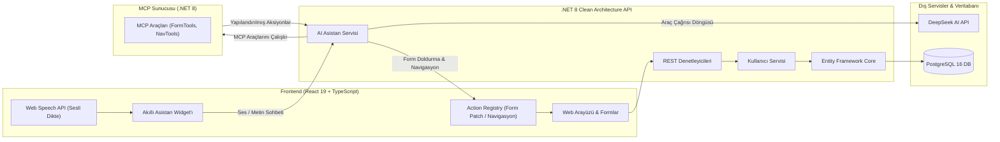

# 🎓 Yapay Zeka Asistanlı (MCP) Okul & Kullanıcı Yönetim Sistemi

[](#) [](README.md)
[](https://dotnet.microsoft.com/)
[](https://react.dev/)
[](https://www.typescriptlang.org/)
[](https://www.postgresql.org/)
[](https://www.docker.com/)
[](https://modelcontextprotocol.io/)

> 🇬🇧 **For the English documentation, please see [README.md](README.md).**

---

## 🌟 Genel Bakış

**Okul & Kullanıcı Yönetim Sistemi**, kurumsal düzeyde **Clean Architecture** (Temiz Mimari) prensiplerini, modern **React 19** arayüzünü ve **Model Context Protocol (MCP)** standartlarını bir araya getiren kapsamlı bir web uygulamasıdır.

Sistem, **Öğrenci** ve **Öğretmen** kayıtlarının hatasız ve doğrulamalı (11 haneli TC No, e-posta benzersizliği, tarih kontrolleri vb.) bir şekilde alınmasını sağlar. Ayrıca, tarayıcı üzerinden Türkçe sesle yazma (**Web Speech API - Dikte**) yapabilen, kullanıcının sesli veya yazılı komutlarını MCP araçları üzerinden doğrudan ekrandaki form alanlarına aktaran ve sayfalar arası yönlendirme yapabilen bir **akıllı yapay zeka asistanı** barındırır.



---

## 🚀 Öne Çıkan Özellikler

1. **Öğrenci Ekleme Sayfası (`/form`, `/ogrenci`, `/student`)**:
   - Ad, soyad, 11 haneli TC kimlik numarası, e-posta, anne adı, baba adı ve doğum tarihi alanları.
   - İstemci ve sunucu (domain) katmanlarında çift yönlü doğrulama.
   - Başarılı kayıt sonrası sistem kayıt ID'si (GUID) ve özet bilgilerini içeren onay kartı.

2. **Öğretmen Ekleme Sayfası (`/teacher`, `/ogretmen`)**:
   - Kimlik ve iletişim bilgilerine ek olarak **Branş / Uzmanlık Alanı** (*Matematik, Fizik, Kimya, Biyoloji, Türkçe/Edebiyat, Tarih, Coğrafya, İngilizce, Bilişim Teknolojileri vb.*) seçimi.
   - Hazır branş öneri listesi (`datalist` & `select`) veya özel branş yazabilme imkanı.
   - Bağımsız form durumu ve yapay zeka araç entegrasyonu.

3. **Kayıt Listeleme ve Arama Sayfası (`/users`)**:
   - Ad, soyad, TC No, e-posta veya ebeveyn bilgilerine göre anlık canlı arama/filtreleme.
   - Toplam kayıt sayısı istatistiği ve anlık yenileme butonu.

4. **Sağ Altta Sabit Akıllı Asistan & Sesli Dikte**:
   - **Sesle Yazma (Speech-to-Text):** Tarayıcının Web Speech API altyapısını kullanarak Türkçe (`tr-TR`) sesli dikte desteği. Duraksamalarda dinlemeyi sürdürür ve konuşmayı metne çevirir.
   - **MCP Araç Çağırma (Tool Calling) Döngüsü:** Kullanıcı *"Öğrencinin adını Ahmet, soyadını Kaya, doğum tarihini 2004-06-18 yap"* dediğinde, DeepSeek AI backend üzerinden MCP sunucusundaki `fill_student_form` veya `fill_teacher_form` aracını çağırır. Dönen `form_patch` aksiyonu istemcide form input'larını otomatik doldurur.
   - **Sayfa Yönlendirme (Navigation Action):** Kullanıcı *"Beni öğretmen ekleme sayfasına götür"* dediğinde, asistan `navigate_to_page` aracı ile kullanıcıyı istemci tarafında `/teacher` sayfasına yönlendirir.

5. **Model Context Protocol (MCP) Sunucusu**:
   - Port `5001` üzerinde Streamable HTTP transport ile `/mcp` uç noktasında çalışan bağımsız MCP servisi.
   - Sayfa tanıma, form şeması okuma, form doluluk durumu kontrolü ve form verilerini normalize ederek yama (patch) üretme araçları.

---

## 🏛️ Mimari ve Teknoloji Yığını

### A. Frontend (İstemci Katmanı)
* **Framework:** React 19, TypeScript, Vite
* **Yönlendirme:** `react-router-dom` v7 (`/form`, `/ogrenci`, `/teacher`, `/ogretmen`, `/users` vb.)
* **Durum Yönetimi:** React Context API (`FormContext`, `FormProvider`) ile ayrıştırılmış öğrenci ve öğretmen state'leri
* **Ses Tanıma:** Web Speech API (`SpeechRecognition` / `webkitSpeechRecognition`)
* **Tasarım:** Modern, cam efektli (glassmorphism), responsive CSS ve CSS değişkenleri

### B. Backend (.NET 8 Clean Architecture)
Clean Architecture prensiplerine göre ayrılmış 4 katman:
* **`Domain Katmanı`**: Dış bağımlılığı olmayan çekirdek katman.
  * Varlıklar: `User` entity'si ve domain kuralları (11 hane TC kontrolü, e-posta formatı, gelecek tarih engelleme).
  * Arayüzler: `IUserRepository`.
  * Hata Sınıfları: `DomainException`.
* **`Application Katmanı`**: İş mantığı, kullanım senaryoları ve AI orkestrasyonu.
  * DTO Modelleri: `CreateUserDto`, `UserResponseDto`.
  * Servisler: `UserService`, `AiAssistantService` (MCP araç çağrı döngüsünü yönetir).
  * Bağlam Çözümleyiciler: `ToolContextResolver`, `IToolContextRegistry`.
* **`Infrastructure Katmanı`**: Veritabanı ve dış servis entegrasyonları.
  * PostgreSQL (Npgsql) ve Entity Framework Core.
  * `DeepSeekAiProvider`: DeepSeek API entegrasyonu ve Function Calling desteği.
  * `McpClientService`: Resmi `ModelContextProtocol.Client` kütüphanesi ile MCP sunucusu bağlantısı.
* **`API Katmanı`**: HTTP sunum katmanı.
  * Denetleyiciler: `UsersController`, `AiAssistantController`, `McpController`.
  * Global Exception Middleware (merkezi hata yakalama).
  * Kök dizinde çalışan Swagger / OpenAPI dokümantasyonu (`/`).

### C. MCP Sunucusu (`server/src/MCP`)
* Bağımsız ASP.NET Core servisi.
* `ModelContextProtocol.Server` altyapısı ile Streamable HTTP transport üzerinde araçlar sağlar.

### D. Veritabanı & Konteynerizasyon
* **Veritabanı:** PostgreSQL 16 Alpine
* **Docker Compose:** Veritabanı, Backend API ve MCP sunucusunu bağımlılık ve sağlık kontrolleriyle tek komutla ayağa kaldıran orkestrasyon dosyası (`docker-compose.yml`).

---

## 📁 Proje Dizin Yapısı

```text
McpTest/
├── docker-compose.yml              # PostgreSQL, API ve MCP orkestrasyonu
├── .env.example                    # Ortam değişkenleri şablonu
├── README.md                       # İngilizce dokümantasyon
├── README_TR.md                    # Türkçe dokümantasyon (bu dosya)
├── PROMPT.md                       # Orijinal mimari gereksinimler belgesi
│
├── client/                         # Frontend Uygulaması (React 19 + TypeScript + Vite)
│   ├── src/
│   │   ├── assistant/              # AI asistan istemci aksiyon işleyicileri
│   │   │   └── actions/
│   │   │       ├── forms/          # Form yamalayıcıları (studentFormHandler, teacherFormHandler)
│   │   │       ├── actionHandlerRegistery.ts
│   │   │       ├── formPatchHandlerRegistry.ts
│   │   │       └── navigationHandler.ts
│   │   ├── components/
│   │   │   ├── AssistantWidget.tsx # Sesli Dikte destekli açılır AI Asistan
│   │   │   └── AssistantWidget.css
│   │   ├── contexts/               # Çoklu form durum yönetimi (Öğrenci & Öğretmen)
│   │   │   ├── FormContext.tsx
│   │   │   ├── FormProvider.tsx
│   │   │   └── useFormContext.tsx
│   │   ├── pages/
│   │   │   ├── HomePage.tsx        # Karşılama ve hızlı yönlendirme sayfası
│   │   │   ├── FormPage.tsx        # Öğrenci ekleme formu
│   │   │   ├── TeacherFormPage.tsx # Öğretmen ekleme formu
│   │   │   └── UsersListPage.tsx   # Filtrelenebilir kayıt listesi tablosu
│   │   ├── services/
│   │   │   ├── api.ts              # /api/users için REST bağlantı servisi
│   │   │   └── assistantApi.ts     # /api/assistant/chat için asistan bağlantısı
│   │   ├── App.tsx                 # Rota tanımları
│   │   └── main.tsx                # İstemci başlangıç noktası
│   ├── package.json
│   └── vite.config.ts
│
└── server/                         # .NET 8 Temiz Mimari Backend Çözümü
    ├── UserManagement.sln
    └── src/
        ├── Domain/                 # Varlıklar, Domain Doğrulamaları, Repository Arayüzleri
        ├── Application/            # DTO'lar, Servisler, AI & MCP İletişim Mantığı
        ├── Infrastructure/         # EF Core, PostgreSQL, DeepSeek AI İstemcisi, MCP İstemcisi
        ├── API/                    # Web API Controller'ları & Middleware'ler
        └── MCP/                    # Model Context Protocol Sunucusu & Araçlar
```

---

## 🛠️ Tanımlı MCP Araçları

MCP Sunucusu tarafından dışa açılan ve DeepSeek AI Asistanı tarafından kullanılan araçlar:

| Araç Adı | Parametreler | Açıklama | Hedef Çıktı |
|---|---|---|---|
| `fill_student_form` | `firstName`, `lastName`, `tcNo`, `email`, `motherName`, `fatherName`, `birthDate` | Öğrenci formundaki alanları normalize ederek doldurur veya günceller. | `target: "studentForm"` |
| `fill_teacher_form` | `firstName`, `lastName`, `tcNo`, `email`, `branch`, `motherName`, `fatherName`, `birthDate` | Öğretmen formundaki alanları (branş dahil) normalize ederek doldurur. | `target: "teacherForm"` |
| `navigate_to_page` | `path` (`/`, `/form`, `/teacher`, `/users`) | Kullanıcının tarayıcısını istenen sayfaya yönlendirir. | `type: "navigation"` |
| `get_current_page` | `currentPage` | Kullanıcının anlık olarak hangi sayfada olduğunu asistana bildirir. | Sayfa adı metni |
| `get_form_status` | Form alanları | Formdaki zorunlu alanların doluluk/boşluk durumunu raporlar. | Durum nesnesi |
| `get_form_schema` | Yok | Form alanlarının isim, etiket ve tür şemasını döner. | Şema nesnesi |

---

## 📡 REST API Endpoint Özeti

### Kullanıcı Yönetimi (`/api/users`)
| Metot | Endpoint | Açıklama |
|---|---|---|
| `POST` | `/api/users` | Yeni kullanıcı/öğrenci/öğretmen kaydeder (11 haneli TC, benzersizlik ve tarih doğrulamalarıyla). |
| `GET` | `/api/users` | Veritabanında kayıtlı tüm kullanıcıları listeler. |
| `GET` | `/api/users/{id}` | Belirtilen GUID ID'ye sahip kullanıcıyı getirir. |
| `GET` | `/api/users/by-tc/{tcNo}` | Belirtilen TC Kimlik Numarasına sahip kullanıcıyı getirir. |

### AI Asistanı (`/api/assistant`)
| Metot | Endpoint | Açıklama |
|---|---|---|
| `POST` | `/api/assistant/chat` | Konuşma geçmişini, mevcut sayfayı ve aktif form verisini alır. DeepSeek function-calling ve MCP döngüsünü çalıştırıp metin cevabı ile UI aksiyonlarını döner. |

---

## 🚀 Kurulum ve Çalıştırma

### Gereksinimler
- [Docker & Docker Desktop](https://www.docker.com/) (Önerilen)
- [.NET 8 SDK](https://dotnet.microsoft.com/download/dotnet/8.0)
- [Node.js 20+](https://nodejs.org/) veya [Bun](https://bun.sh/)
- Geçerli bir [DeepSeek API Key](https://platform.deepseek.com/)

---

### Seçenek 1: Docker Compose ile Başlatma (Önerilen)

1. **Ortam Değişkenlerini Hazırlayın:**
   Kök dizindeki `.env.example` dosyasını `.env` olarak kopyalayın:
   ```bash
   cp .env.example .env
   ```
   DeepSeek API anahtarınızı girin:
   ```env
   POSTGRES_DB=usermanagement_db
   POSTGRES_USER=postgres
   POSTGRES_PASSWORD=postgrespassword
   DEEPSEEK_API_KEY=your_deepseek_api_key_here
   DEEPSEEK_BASE_URL=https://api.deepseek.com/
   DEEPSEEK_MODEL=deepseek-chat
   ```

2. **Konteynerleri Başlatın:**
   ```powershell
   docker compose up --build -d
   ```

   Servisler hazır olduğunda:
   - **PostgreSQL 16:** `localhost:5432`
   - **Backend Web API:** `http://localhost:5000` (Swagger UI: [http://localhost:5000](http://localhost:5000))
   - **MCP Server:** `http://localhost:5001/mcp`

3. **Frontend Uygulamasını Başlatın:**
   ```powershell
   cd client
   bun install   # veya: npm install
   bun run dev   # veya: npm run dev
   ```
   Tarayıcınızda **`http://localhost:5173`** adresine gidin.

---

### Seçenek 2: Docker Olmadan Yerel Ortamda Başlatma

#### 1. PostgreSQL Servisini Başlatın
PostgreSQL'in yerel olarak `5432` portunda çalıştığından ve `usermanagement_db` veritabanının mevcut olduğundan emin olun.

#### 2. MCP Sunucusunu Başlatın
```powershell
cd server/src/MCP
dotnet run --launch-profile http
```
*`http://localhost:5001` üzerinde dinler.*

#### 3. Backend API'yi Başlatın
```powershell
cd server/src/API
dotnet run --launch-profile API
```
*`http://localhost:5000` üzerinde dinler.*

#### 4. Frontend Uygulamasını Başlatın
```powershell
cd client
bun install
bun run dev
```
*`http://localhost:5173` üzerinde açılır.*

---

## 🎙️ Sesli Dikte (Speech-to-Text) Kullanımı

Sağ alttaki akıllı asistan widget'ında bulunan mikrofon ikonu **Web Speech API** kullanır:
- **Destekleyen Tarayıcılar:** Google Chrome, Microsoft Edge ve Chromium tabanlı tarayıcılar.
- **Dil:** Türkçe (`tr-TR`).
- **Sürekli Dinleme:** Konuşma durakladığında dahi oturumu açık tutarak kesintisiz dikte sağlar.
- **Örnek Kullanım:** Mikrofona tıklayın ve söyleyin:
  > *"Öğrenci adı Ayşe, soyadı Yılmaz, TC kimlik numarası 11223344556, doğum tarihi 12 Nisan 2003 olsun"*
  
  Asistan söylediklerinizi analiz eder, MCP `fill_student_form` aracını çağırır ve ekrandaki formu anında otomatik olarak doldurur!

---

## 🧪 Derleme ve Doğrulama Komutları

Frontend ve Backend projelerini test etmek için:

```powershell
# .NET Çözümünü derleyin
dotnet build server/UserManagement.sln

# React istemcisini tip kontrolünden geçirin ve derleyin
cd client
bun run build   # veya: npm run build
```

---

## 📄 Lisans

Bu proje MIT Lisansı ile lisanslanmıştır. Detaylar için [LICENSE](LICENSE) dosyasına bakabilirsiniz.
